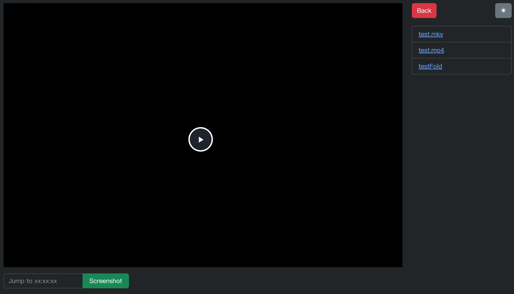

# WebPlaya
A simple web player that offers basic video  browsing and screenshot functions.

- Supports mainstream video formats.
- The screenshot quality is not affected by using Canvas.drawImage.
- Generated screenshots will be automatically deleted after downloading, leaving no junk files.


## Screenshot




## Quick Start

You can either use docker-compose or the docker cli.

### docker-compose

```yaml
version: "3"
services:
  app:
    image: muxray/webplaya:latest
    container_name: webplaya
    volumes:
      - /path/to/videos:/app/public/videos
      - /path/to/icon:/app/public/fav.png #Optional,You can use your own image as the favicon.
    ports:
      - "3000:3000" #Replace the port  you need
```

### docker cli

```bash
docker run -d \
  --name=webplaya \
  -p 3000:3000 #Replace the port you need\
  -v /path/to/videos:/app/public/videos \
  -v  /path/to/icon:/app/public/fav.png #Optional \
  muxray/webplaya:latest
```

or you can build the image by yourself

```bash
git clone https://github.com/tukanoma/WebPlaya.git && cd WebPlaya
docker build . -t webplaya:latest
```
## Usage

### Keyboard shortcuts.

- Play or Pause : Space key
- Fast-forward or rewind 1s :  ➡️ or ⬅️
- Fast-forward or rewind 1/10s : Shift + ➡️ or ⬅️
- Volume : ⬆️ or ⬇️
- Mute audio :  M key
- Fullscreen : F key
- Screenshot : S key (in fullscreen mode still works)

The time format for jumping is xx:xx:xx, and it is also possible to input only minutes or seconds.
(note that if the time entered exceeds the length of the video, only a screenshot of the current frame will be generated)

The generated screenshot file name is "video name _ screenshot time(convert in seconds) _Screenshot.png".
